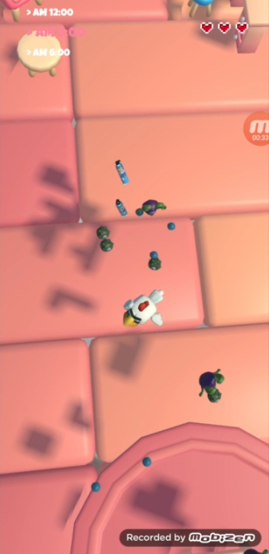
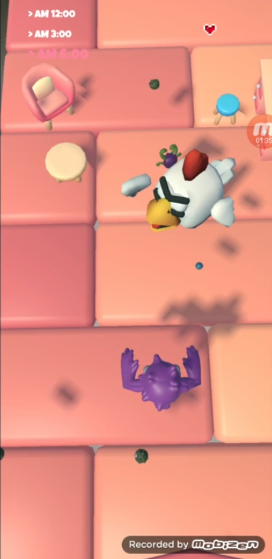

# [IMP] Immersive Media Programming (2025 Spring)
### Unity AR Game Team Project

1. [About the Game](#1-about-the-game)  
2. [Architecture](#2-architecture)
3. [In Game Screenshots](#3-in-game-screenshots)
4. [Assets](#4-assets)
---

### 1. About the Game
- Marker-based AR game
- Player device will detect the plane.
- Place the room on the detected plane.
- Move character with the marker.
- The character grows by eating smaller enemies.
- Get away from larger enemies.

---
### 2. Architecture
- System  
  |class|function|
  |---|---|
  |GameManager|manage game status (GameClear, GameOver)|
  |UIManager|overlay infos (stage no., remain health)|
  |AudioManager|manage BGM, SFX

- Player  
  |class|function|
  |---|---|
  |PlayerSpawner|spawn player character on the room prefab|
  |PlayerController|detect the marker, move the charater prefab|
  |PlayerAnimator|play the character animation interacting with game objects|

- Enemy  
  |class|function|
  |---|---|
  |EnemySpawner|spawn enemy prefabs around the character prefab|
  |EnemyController|move toward the character prefab (no direction update)|
  |BossController|chase the character prefab (update direction continuously)|

- Item  
  |class|function|
  |---|---|
  |ItemSpawner|spawn items randomly around the character prefab|
  |ItemSpray|remove enemies instantly when collides with the character prefab|
  
- Scene (loop)  
  |scene|mode|
  |---|---|
  |UI|single|
  |Stage1|additive|
  |Stage2|additive|
  |Stage3|additive|

---
### 3. In Game Screenshots

---
### 4. Assets

- [Micro Rooster Rudy - Proto Series](https://www.fab.com/listings/ca5d2bf3-3fa2-4625-ae73-ddc74ee4f9c2)  
- [Stylized Bedroom Kit](https://assetstore.unity.com/packages/3d/environments/stylized-bedroom-kit-308050)  
- [Ultimate Monsters Pack](https://sketchfab.com/3d-models/ultimate-monsters-pack-fd72e114d119488da71fe3a16f216c4f)  
- [FLY KILLER SPRAY Free 3D model](https://www.cgtrader.com/free-3d-models/animals/insect/fly-spray) (AI generated texture used)
